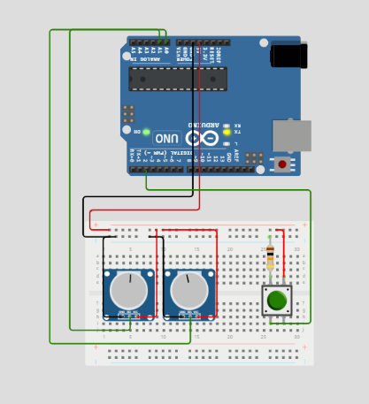
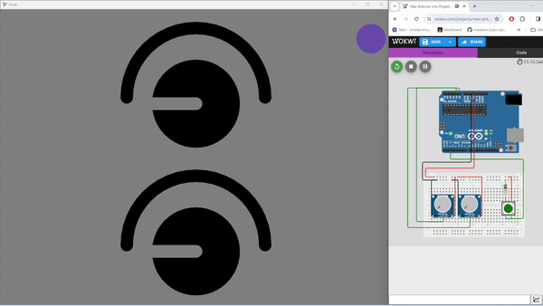

# Arduino + threepp

This project demonstrates the connection between a desktop C++ program using the 3D library [threepp](https://github.com/markaren/threepp) and an Arduino program.
Both a physical and a [virtual Arduino](https://wokwi.com/projects/389729793352855553) can be used. The virtual Arduino is powered by [wokwi](https://wokwi.com/).
The arduino source is located in `/arduino_src` as a [platform.io](https://docs.platformio.org/en/latest/core/index.html) project.

The desktop app and Arduino communicates over serial using JSON. To make the virtual connection possible, [com0com](https://com0com.sourceforge.net/) is utilised.
On Mac [socat](https://formulae.brew.sh/formula/socat) might be an alternative. Chrome must be used.

### Component setup

## Showcase

